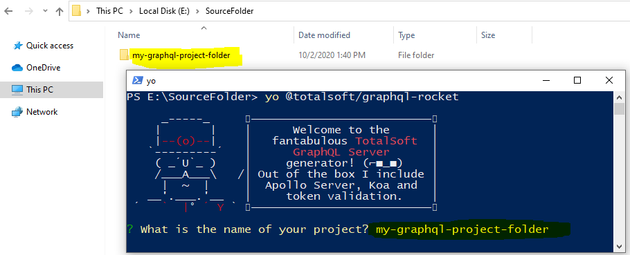
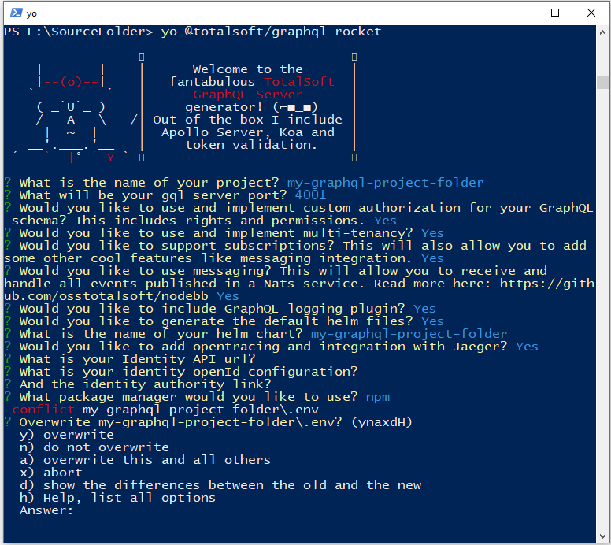

# graphql-rocket [![NPM version][npm-image]][npm-url]
>GraphQL server sample with Apollo Server, Koa middleware, database reads using Knex JS, and/or REST API consumer, token validation, messaging integration with Redis and Nats and many other cool features.


> If you are creating a new web application we recommend you to use our [Webapp Rocket Generator](https://github.com/osstotalsoft/generator-webapp-rocket).

## Installation  
  
First, install [Yeoman](http://yeoman.io) and @totalsoft/generator-graphql-rocket using [npm](https://www.npmjs.com/) (we assume you have pre-installed [NodeJS Latest LTS Version](https://nodejs.org/). Old versions of NodeJS are also supported.)

>⚠ Use the npm version supported by your installed NodeJS version. 

>e.g. NodeJS Latest LTS Version: 14.17.1 (includes npm 6.14.13)
  
```bash  
npm install -g yo
npm install -g @totalsoft/generator-graphql-rocket
```  
  
If you want to use this generator to scaffold a new project navigate to section: [Generate new project](#generate-new-project)  
To upgrade an existing project that was scaffold using this **GraphQL Rocket Generator**, see section: [Upgrade existing project](#upgrade-existing-project)  

## Content
1. [Generate new project](#generate-new-project)  
2. [Upgrade existing project](#upgrade-existing-project)  
3. [What is a Generator?](#what-is-a-generator)  
4. [Code formatting](#code-formatting)
5. [Enforcing Coding Conventions](#enforcing-coding-conventions)
6. [Token validation](#token-validation)  
7. [Authorization](#authorization)  
8. [Multi-tenancy](#multi-tenancy)
9. [Subscriptions](#subscriptions)  
10. [Messaging](#messaging)  
11. [Error logging](#error-logging) 
12. [OpenTracing](#opentracing)
13. [Code examples](#code-examples)
14. [Deployment](#deployment)
15. [HashiCorp Vault](#hashicorp-vault)
16. [Getting To Know Yeoman](#getting-to-know-yeoman)

## Generate new project  
To scaffold your new GraphQL server using our generator run:  

```bash
yo @totalsoft/graphql-rocket
```
> ⚠ Make sure you have the latest version of **GraphQL Rocket Generator** installed, else you will be prompted the following message:


You will be prompted to introduce the following information:
 1. The project name. This will also be the name of the folder in which the new server will live. A valid project name, only includes lower and upper case letters, digits and '-' or '_' separators! No special characters and whitespace are allowed and do not start or end with a separator!
 2. GraphQL port. By default it would be set to `4000`
 3. Include multi-tenancy. By default is set to false.
 4. Use subscriptions. By default is set to false.
 5. Add messaging integration. By default is set to false.
 6. Implement authorization. By default is set to false. This includes rights and permissions.
 7. Include GraphQL logging plugin. By default is set to false. This also catches all error and throws an error friendly message. Read more bellow.
 8. Whether to generate default helm files or not.
 9. The name of your helm chart. Provide a valid helm chart name, only use lower case letters, digits and '-' separators! No special characters and whitespace are allowed and do not start or end with a separator!
 9. Add Opentracing using Jaeger. By default is set to false.
 10. Identity API url, your Identity server API url.
 11. Identity openId configuration.
 12. Identity authority.
 13. What package manager you wish to use to install the application dependencies. (npm or yarn).
 
If you would like to start the application, simply run ``npm start`` in the newly created folder, otherwise you can begin editing and writing your application!

## Upgrade existing project  
⚠ **First, make sure you have committed everything or have a backup of your existing project.**

⚠ **RECOMANDATION!** ⚠
________
To avoind having lots of differences, make sure you have **Prettier** formatter installed in your project. 
``npm install prettier --dev``

Also a file named **.prettierrc** containing the desired formatting settings is placed in the root of the project.  See [Code formatting](#code-formatting) section to see the generator's default config file. 

Then apply your formatting rules to the existing files by executing:
``prettier --write **/*.js``
________

To upgrade an existing project that was scaffold using this generator open a console outside of your project folder ( see image below )  and run:
```bash  
yo @totalsoft/graphql-rocket
```  
  

Now you will be asked to answer the same questions explained in  [Generate new project](#generate-new-project)  section.
> ⚠ **ATTENTION!** ⚠

> When prompted to enter the name of your project **make sure you enter the name of the project you want to upgrade** ( like shown in the above image ). If you enter a new name, it will generate a new project. 

Mainly you have to choose all the options already included in your existing project, or you can add new ones. 

> ⚠ If you decide not to include an option that was previously installed on your existing project (e.g. Authorization), **Yeoman** will not remove files or folders by its own, he just merges existing files or created new ones, and you would have to manually delete the unnecessary files or folders.

After answering all the questions, **Yeoman** will ask you for each file if you want to overwrite it with the latest version. You can type `a`, and this will automatically override all the files, and all the changes could be seen in as changes in your IDE, and it's up to you to check all the changed files before you commit everything. 
Or hit **space** to see all your options (see below image).

  

## What is a Generator?
A Yeoman generator is a scaffolding tool. You can use Yeoman to install applications based on templates. This repository is an example of a template - an application with a build, code structure, and dependencies installed and organised for you!

Using a generator accelerates application development. You don't have to worry about best practices for foundational elements, because we've incorporated them. Our template generates a fully functional GraphQL server that becomes the infrastructure of your new project. Before this miracle generator existed, this code would probably took you a few days to write, oh well... now this will be done in only 30 seconds!

Included latest versions of the following libraries and technologies: <b>GraphQL,  [Apollo Server](https://github.com/apollographql/apollo-server), [Koa](https://koajs.com/), [@totalsoft/nodebb](https://github.com/osstotalsoft/nodebb), [graphql/dataloader](https://github.com/graphql/dataloader), [knex.js](https://knexjs.org/), [Redis](https://github.com/luin/ioredis) </b> and many more, see generators/app/templates/infrastructure/package.json file.

## Code formatting  
The generated code is formatted using the **Prettier** formatter. A file named **.prettierrc** containing the formatting settings is placed in the root of the project.  
  
For maintaining unitary style, the **.prettierrc** configuration file is read by other tools that run **Prettier** such as scripts or IDE extensions. For example if using **Visual Studio Code** we recommend installing the following extension [Prettier formatter](https://marketplace.visualstudio.com/items?itemName=esbenp.prettier-vscode)  
  
In case the **.prettierrc** file is customized, the new settings will be used when re-running the generator. The only condition is to answer **no** when asked to overwrite this file.  

The default prettier config file can be found here: [.prettierrc](generators/app/templates/infrastructure/.prettierrc)

## Enforcing Coding Conventions

Ensuring code quality is very important for a maintainable and scalable application. As a default, this generator automatically will install and configure ESLint and Prettier in your project, for a consistent code formatting. ( Read more about this in [Code formatting](#code-formatting) section. ).

To help you enforce this standards, the generator also comes with this great library called **Husky** ( 🐶 woof! ).

**[Husky](https://typicode.github.io/husky/#/)** is a JavaScript package that allows you to run some code during various parts of your git workflow. Husky leverages git hooks to allow you to hook into various git events such as pre-commit and pre-push.

This application uses husky to trigger lint-staged during the pre-commit hook to automate the tedious part of your workflows, such as formatting with Prettier and/or linting with ESLint. Your code gets fixed before it ever leaves your machine, so you don’t have to wait for your CI to inform you that you forgot to run the formatter or linter.

  ### ⚠ Configuring a monorepo with multiple packages
By design, `husky install` must be run in the same directory as `.git`. If your project is a monorepo containing multiple packages, for example a Server and Client sub-folders, husky will expects your `package.json` to be at the root of your project.

If you don't want to add a separate `package.json` in your root just for this, you need to change the husky configurations in your Server and Client projects as follows:

* Change directory during prepare script and pass a subdirectory
```
// clientProject/package.json
"scripts": {
    "prepare": "cd .. && husky install clientProject/.husky"
}
```
```
// serverProject/package.json
"scripts": {
    "prepare": "cd .. && husky install serverProject/.husky"
}
```

* You'll also need to change directory in one of Client or Server hooks and write for both projects  
```
// clientProject/.husky/pre-commit
#!/bin/sh
. "$(dirname "$0")/_/husky.sh"
cd serverProject
npx lint-staged
npm run test:ci
cd ../clientProject
npx lint-staged
npm run test:ci
```

* Run `npm install` in both projects and that’s it! Now if you try to make a commit, you will see that eslint and prettier will run and fix themselves as you would expect.

## Token validation
This GraphQL server is expecting that all the applications and services that consumes him, uses an Identity server that generates secure jwk authentication tokens. 

Our server defines a middleware  function that decodes the token and validate it against the Identity server on every request using the following libraries:[jsonwebtoken](https://github.com/auth0/node-jsonwebtoken) and [jwks-rsa](https://github.com/auth0/node-jwks-rsa). 

## Authorization
When building a service or any other application it is crucial to make it secure, besides token validation, there might be the need to limit access to certain fields, types or even endpoints. We can help you do this too. 

To implement restriction rules we use [graphql-shield](https://github.com/maticzav/graphql-shield). If you answered with `true` to the "Implement authorization" question prompted at the beginning, there will be an example of permission checking included in this sample. (See `src/middleware/permissions`)

In addition, we will include two constant files: `src/contants/identityUserRoles.js` containing the default roles that comes from the Identity server and `src/contants/permissions.js` that contains your defined application roles.

To define a new role, assuming it was already added in the database, you should export it from `src/constants/permissions` file.

By default the permission check is made by checking the `UserRight` table (This function can me replace and changes as desired):

``` 
const checkForPermission = async (permissions, { dbInstance, externalUser }) => {
    try {
        const { id } = await dbInstance.select("Id").from("User").where("ExternalId", externalUser.id).first()
        const rights = await dbInstance.select("Name as Right").from("UserRight")
            .join('[Right]', { 'Right.Id': 'RightId' })
            .where("UserRight.UserId", id)

        return intersection(permissions, rights.map(x => x.right)).length > 0
    }
    catch (error) {
        throw new ForbiddenError(`Authorization check failed! The following error was encountered: ${error}`)
    }
}
```

To implement restrictions you first have to define your rules and them apply them in the "shield" defined on top of your GraphQL schema.
e.g.: 
```
const isAuthenticated = rule({ cache: 'contextual' })(
    (_parent, _args, context) => !!context.externalUser.id
)

const isAdmin = rule({ cache: 'contextual' })(
    (_parent, _args, { externalUser }, _info) => includes(admin, externalUser.role) || includes(globalAdmin, externalUser.role)
)

shield({
    User: {
        rights: isAuthenticated
    },
    Query: {
        userList: isAuthenticated
    },
    Mutation: {
        updateUser: and(isAuthenticated, isAdmin)
    }
})
```

## Multi-tenancy
If you need to handle multi-tenancy in your new application, you can just reply with `yes` when you are being prompted about this topic at the beginning and voilà! Everything will be done for you.

This feature comes with	a middleware function that identitfies the tenant on every request using different strategies. By default it first looks for the tenantId in the query string ( `request.query.tenantId` ), if not there then we'll decode the token and try to extrat it from there. You can use other strategies of tenant identification, we also included some you can choose from or you can define your own.

```
const tenantIdentification = () => async (ctx, next) => {
    if (!ctx.tenant) {
        const tenantId = R.ifElse(
            getTenantIdFromQueryString,
            getTenantIdFromJwt
        )(ctx)

        ctx.tenant = await tenantService.getTenantFromId(tenantId);
    }
    await next();
}

const getTenantIdFromJwt = ({ token }) => {
    let tenantId = null;
    if (token) {
        const decoded = jsonwebtoken.decode(token.replace("Bearer ", ""));
        if (decoded) {
            tenantId = decoded.tid;
        }
    }
    return tenantId;
}
const getTenantIdFromQueryString = ({ request }) => request.query.tenantId

const getTenantIdFromHeaders = ctx => ctx.req.headers.tenantid

const getTenantIdFromHost = ctx => ctx.hostname

const getTenantIdFromRefererHost = async ctx => {
    if (!ctx.request.headers.referer) {
        return;
    }
    var url = new URL.parse(ctx.request.headers.referer);
    return url.hostname
};
```

In addition, when choosing this option, you will find a `src/features/tenant` folder. This contains the infrastructure (query, resolvers, dataLoaders and api functions) you can use to manage multi-tenancy in your frontent application. This is the missing piece for the **Tenant Selector** component, a part of the [Webapp Rocket Generator -> Multy-tenancy](https://github.com/osstotalsoft/generator-webapp-rocket#multi-tenancy).

## Subscriptions

By default allows you to handle subscriptions in you GraphQL server using Redis or in-memory ([pubSub implementations](https://www.apollographql.com/docs/apollo-server/data/subscriptions/#pubsub-implementations)). 
To learn how to handle subscriptions in your GraphQL server see [Apollo Server documentation](https://www.apollographql.com/docs/apollo-server/data/subscriptions/#subscriptions-example).

## Messaging

In some cases you may need to handle external events in you GraphQL server. To do this, our template integrates with [@totalsoft/nodebb](https://github.com/osstotalsoft/nodebb), allowing you to handle events published in a message bus using Nats, Kafka, etc. For more details see its documentation.

This feature will include the `src/messaging` folder, which contains all the things you need to develope your first ervent handler.

1. First, you need to define the event topic you want to listen by exporting it as a string from `src/messaging/topics.js` file.
2. Write the message handler itself, you cand cerate it in your feature folder and add it in the `src/messaging/msgHandlers.js` file.
3. (Optional) `MessagingDataSource` - this allows you to define a custom Apollo data source that helps you explicitly publish or subscribe to events on the message bus.

Being a totally different context, we would have to apply all the middleware functions and strategies that are normally executed on a basic GraphQL request. To to so, in your `src/index.js` file you fill see the following code:
```
messagingHost()
    .subscribe([
        topics.USER_PHONE_CHANGED,
        topics.USER_EMAIL_CHANGED
    ])
    .use(exceptionHandling())
    .use(correlation())
    .use(middleware.tracing())
    .use(middleware.tenantIdentification())
    .use(middleware.dbInstance())
    .use(dispatcher(msgHandlers))
    .start()
```
This code basically executes the same middleware functions in the same order as they are executed on a GraphQL request.

When using messaging, you need to opt-in between two existing messaging transports:
- `nats`: uses [Nats streaming](https://github.com/nats-io/nats-streaming-server)
- `rusi`: uses a sidecar container, powered by [rusi](https://github.com/osstotalsoft/rusi), to offload messaging concerns

You can find more details [here](https://github.com/osstotalsoft/nodebb/blob/master/packages/message-bus/README.md#transport)

## Error logging

This features includes a logging plugin, that helps you monitor the execution of your GraphQL operations with the use of the request life cycle events. Read  more about Apollo Server plugins here: [Plugins](https://www.apollographql.com/docs/apollo-server/integrations/plugins/)

By default all the logs are saved in the application database ( this can be changed by modifying the `saveLogs()` method found in `src/plugins/logging/loggingUtils.js` file. 

You need the following table in your database to store your logs:
```
CREATE TABLE [dbo].[EventLog](
	[EventLogId] [int] IDENTITY(1,1) NOT NULL,
	[Uid] [uniqueidentifier] NOT NULL,
	[RequestId] [uniqueidentifier] NOT NULL,
	[Code] [nvarchar](50) NOT NULL,
	[Message] [nvarchar](max) NOT NULL,
	[Details] [nvarchar](max) NOT NULL,
	[TimeStamp] [datetime] NOT NULL,
	[LoggingLevel] [nvarchar](50) NOT NULL,
	[TenantId] [uniqueidentifier] NULL
) ON [PRIMARY] TEXTIMAGE_ON [PRIMARY]
```

In addition, the errors thrown inside Apollo Server, are wrapped in a 'user friendly message'. This helps you not to leak sensitive data from unauthorized users.

## OpenTracing

Microservice Architecture has now become the obvious choice for application developers, but how can you debug and monitor a set of interdependent distributed services? Here comes OpenTracing to help us. This generator, includes an OpenTracing integration using Jaeger, helping you monitor all the components of your GraphQL server ( SQL, Knex statements, GraphQL request lifecycle both Http and WebSocket and of course traces requests and events handled in your messaging handlers.

This feature includes a tracing middleware you can find in `src/middleware/tracing`, a plugin that traces GraphQL requests located at `src/plugins/tracing` and the `src/tracing` folder includes utils files and also the knex/sql tracing implementation. 

In addition, to activate this option, you will need to make a few configuration in server's `.env` file:

```
JAEGER_SERVICE_NAME=<%= projectName %>
JAEGER_AGENT_HOST=
JAEGER_AGENT_PORT=
JAEGER_SAMPLER_TYPE=const
JAEGER_SAMPLER_PARAM=1
JAEGER_DISABLED=true
```
## Code examples

To help you out starting developing a feature in your new server, we included some code samples ( see `src/features/user`). This code's purpose is not only to help you wrap you head around SDL and GraphQL development in general, but it also comes with the queries and data needed to implement authorization in your web application, the missing part from [Webapp Rocket Generator -> Authorization ](https://github.com/osstotalsoft/generator-webapp-rocket#authorization).

## Deployment
When you are ready you can deploy your application on any platform. This template also includes a pre-configured Dockerfile and optional Helm files.
Application (or non-system) containers security can be enhanced by running as a non-root user. This can reduce the damage done by a malicious actor that gains access to the application and the underlying system, because it will have only the rights assigned to that user (for example it will not be able to install arbitrary software). Once the project is generated, a user is created for your project. Default name is "appuser". You can change the name in Dockerfile.

## HashiCorp Vault
HashiCorp Vault is a secrets management tool specifically designed to control access to sensitive credentials in a low-trust environment. It can be used to store sensitive values and at the same time dynamically generate access for specific services/applications on lease. Plus, Vault can be used to authenticate users (machines or humans) to make sure they are authorized to access a particular file.
The generated project comes with default configurations for Vault. At release time, the configurations must be changed with the Vault secrets defined for your project. 
By default, the project doesn't use secrets defined in Vault. In order to use it, the 'vaultEnvironment' property must be set to true in values.yaml at release.


More info: https://opensource.com/article/18/3/just-say-no-root-containers
## Getting To Know Yeoman
 * Yeoman has a heart of gold.
 * Yeoman is a person with feelings and opinions, but is very easy to work with.
 * Yeoman can be too opinionated at times but is easily convinced not to be.
 * Feel free to [learn more about Yeoman](http://yeoman.io/).

## License

MIT

[npm-image]: https://badge.fury.io/js/%40totalsoft%2Fgenerator-graphql-rocket.svg
[npm-url]: https://www.npmjs.com/package/@totalsoft/generator-graphql-rocket
